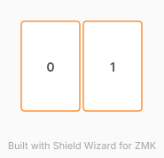

# ZMK Configuration for KB_MPR121_01

*Generated by Shield Wizard for ZMK*



Download compiled firmware from the Actions tab. <https://zmk.dev/docs/user-setup#installing-the-firmware>

Edit your keymap <https://zmk.dev/docs/keymaps>.
User keymap is located at [`config/kb_mpr121_01.keymap`](config/kb_mpr121_01.keymap).

-----

<details>
<summary>
Shield Wizard Debug Information
</summary>

In case of broken configuration, here is the Shield Wizard internal data used to generate this configuration:

Commit: 84a348b08cf4fec4a5441a46147e9a345b10ffab

```json
{"name":"KB_MPR121_01","shield":"kb_mpr121_01","dongle":false,"modules":[],"layout":[{"id":"01M3YSE79P8SHSJ54QQGVB87PM","part":0,"row":0,"col":0,"w":1,"h":1.5,"x":0,"y":0,"r":0,"rx":0,"ry":0},{"id":"01M3YSEK7GD4RZEB4H12WS0V76","part":0,"row":0,"col":1,"w":1,"h":1.5,"x":1,"y":0,"r":0,"rx":0,"ry":0}],"parts":[{"name":"unibody","controller":"nice_nano_v2","pins":{"d9":{"usage":"kscan","kscan":"01M3YSM5C4ZG028MN9SQBJFA7N","role":"input"},"d8":{"usage":"kscan","kscan":"01M3YSM5C4ZG028MN9SQBJFA7N","role":"input"}},"kscans":[{"kind":"direct","id":"01M3YSM5C4ZG028MN9SQBJFA7N","mode":"gnd"}],"keys":{"01M3YSEK7GD4RZEB4H12WS0V76":{"input":"d9"},"01M3YSE79P8SHSJ54QQGVB87PM":{"input":"d8"}},"encoders":[],"buses":{}}]}
```

</details>
